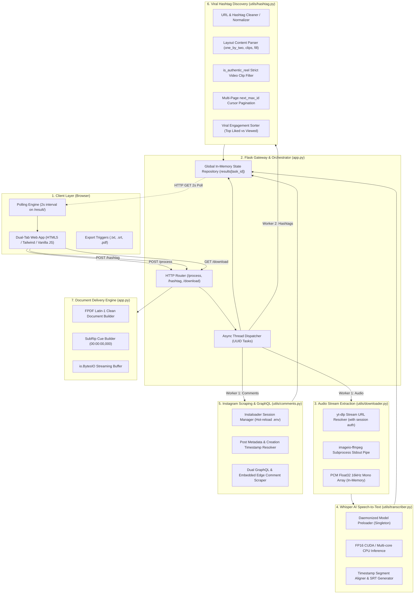
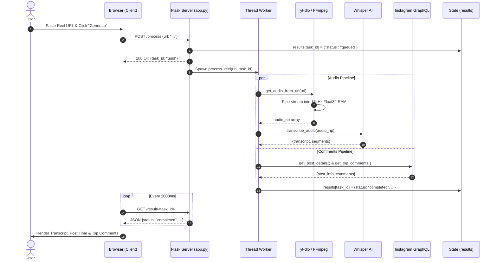
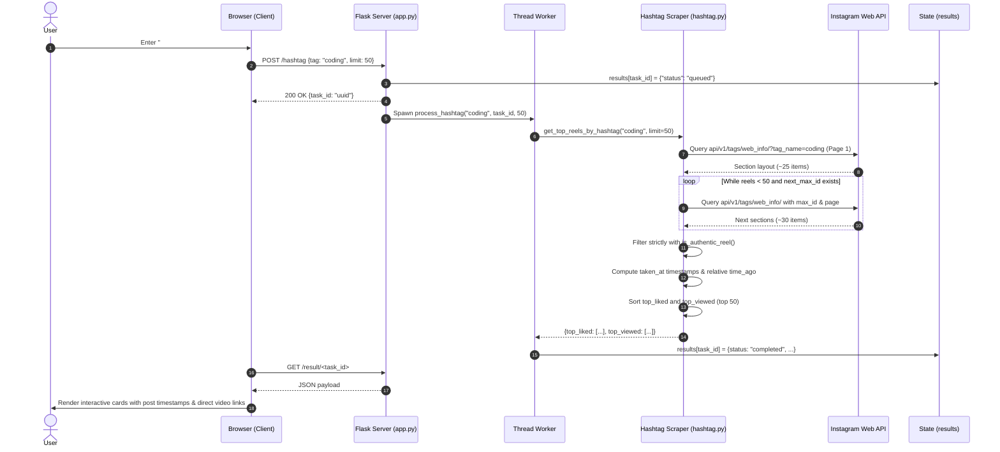

# ReelScribe — Complete System Architecture & Operational Blueprint

This document provides the complete, authoritative architectural specification for **ReelScribe**, detailing its high-concurrency asynchronous pipeline, in-memory audio streaming, Whisper AI speech-to-text integration, Instagram GraphQL scraping, viral hashtag discovery, and multi-format document delivery.

---

## 🏛️ High-Level System Architecture

---

## 🔍 Detailed Subsystem Breakdown

### 1. Client Presentation & Polling Layer
- **Source Files:** [`templates/index.html`](file:///c:/Users/Admin/Desktop/New%20folder/templates/index.html), [`static/main.js`](file:///c:/Users/Admin/Desktop/New%20folder/static/main.js), [`static/style.css`](file:///c:/Users/Admin/Desktop/New%20folder/static/style.css)
- **Key Responsibilities:**
  - Provides a modern, responsive glassmorphic interface with dual tabs: **Reel Transcriber** and **Hashtag Explorer**.
  - Includes a `<meta name="referrer" content="no-referrer">` header to prevent Facebook CDN from dropping requests with `403 Forbidden` due to third-party referrers.
  - Controls non-blocking UI state via `pollResult()` and `pollHashtagResult()`, polling `/result/<task_id>` every 2,000 milliseconds.
  - Formats numbers into compact social metrics (e.g. `15.1K`, `1.2M`) and timestamps into relative human-friendly time badges (`🕒 2d ago`, `📅 Sep 18, 2026`).

---

### 2. Application Gateway & Task Dispatcher
- **Source Files:** [`app.py`](file:///c:/Users/Admin/Desktop/New%20folder/app.py)
- **Key Responsibilities:**
  - Routes requests: `GET /`, `POST /process`, `POST /hashtag`, `GET /result/<task_id>`, `GET /download/<task_id>/<format>`, and `GET /architecture`.
  - Dispatches heavy computational and network workloads into isolated background threads (`threading.Thread`).
  - Maintains a thread-safe in-memory state dictionary `results[task_id]` holding status, progress messages, error reports, and completed payloads.
  - Serves dynamic document streams (`io.BytesIO`) for `.txt`, `.srt`, and `.pdf` without creating temporary files on the filesystem.

---

### 3. Media Pipeline & Audio Extraction Engine
- **Source Files:** [`utils/downloader.py`](file:///c:/Users/Admin/Desktop/New%20folder/utils/downloader.py)
- **Key Responsibilities:**
  - Authenticates with Instagram via `yt-dlp` using `.env` credentials.
  - Resolves direct signed audio CDN URLs (`extract_info(download=False)`).
  - Invokes bundled `imageio-ffmpeg` via `subprocess.Popen` with parameters:
    `-i <stream_url> -f s16le -ac 1 -ar 16000 -`
  - Captures the standard output stream directly into RAM and converts it to a normalized Float32 numpy array `[-1.0, 1.0]` for Whisper ingestion.

---

### 4. OpenAI Whisper AI Speech-to-Text Engine
- **Source Files:** [`utils/transcriber.py`](file:///c:/Users/Admin/Desktop/New%20folder/utils/transcriber.py)
- **Key Responsibilities:**
  - Launches a background daemon thread at server startup to preload the Whisper `base` neural network, eliminating runtime cold starts.
  - Automatically identifies available compute hardware: activates CUDA FP16 tensor cores if an NVIDIA GPU is available, or falls back to multi-threaded CPU Float32 execution.
  - Generates full transcription text alongside detailed time-stamped word/phrase segments (`start`, `end`, `text`).
  - Provides `generate_srt(segments)` to format millisecond timestamps into SubRip subtitle standard (`00:01:23,456 --> 00:01:27,890`).

---

### 5. Instagram Scraper & GraphQL Engine
- **Source Files:** [`utils/comments.py`](file:///c:/Users/Admin/Desktop/New%20folder/utils/comments.py)
- **Key Responsibilities:**
  - Manages Instaloader session state with automatic hot-reloading if `IG_SESSIONID` is updated in `.env`.
  - `get_post_details(url)`: Extracts creator username, like count, comment count, and post creation timestamp (`post.date_utc`), converting it to formatted UTC and relative time.
  - `get_top_comments(url)`: Implements a dual-path scraping strategy:
    1. Fast inspection of embedded post edge metadata (`edge_media_to_parent_comment`).
    2. Deep pagination using Instagram's Web GraphQL query hash `97b41c52301f77ce508f55e66d17620e`.
  - Parses each comment node into structured objects including like counts, verified checkmarks, threaded replies, and extracted external links (`URL_REGEX`).

---

### 6. Viral Hashtag Discovery & Pagination Engine
- **Source Files:** [`utils/hashtag.py`](file:///c:/Users/Admin/Desktop/New%20folder/utils/hashtag.py)
- **Key Responsibilities:**
  - `clean_tag_name(tag)`: Intelligently strips explore URLs (e.g. `https://www.instagram.com/explore/tags/coding/`), `#` symbols, spaces, and punctuation.
  - `is_authentic_reel(m)`: Strictly validates that the media item is a genuine vertical video reel (`product_type == 'clips'` or `clips_metadata`), possesses valid `video_versions`, and excludes static photos (`media_type == 1`) or photo carousels (`media_type == 8`).
  - **Multi-Page Cursor Pagination:** Uses `next_max_id` and `next_page` to loop through Instagram's `api/v1/tags/web_info/` endpoint across multiple sections until at least 50 validated reels are collected.
  - Ranks results into two distinct engagement sets: **`top_liked`** (sorted by likes descending) and **`top_viewed`** (sorted by views/plays descending).

---

## ⚡ Operational Sequence Diagrams

### 1. Reel Transcription Workflow

### 2. Hashtag Discovery Workflow

---

## 🛡️ Security, Resilience & Anti-Blocking Measures

1. **Meta/Facebook CDN Hotlinking Defense (`<meta name="referrer" content="no-referrer">`)**:
   - Meta CDN servers strictly reject direct video stream and thumbnail access when incoming requests contain an unauthorized third-party referrer header (e.g. `http://127.0.0.1:5000/`).
   - Setting the referrer policy to `no-referrer` ensures all outgoing media requests are stripped of referrer metadata, enabling seamless direct playback and image rendering.

2. **Session Hot-Reloading (`utils/comments.py`)**:
   - The application checks the current `IG_SESSIONID` environment variable on every operation.
   - If session cookies expire or are rotated in `.env`, the Instaloader client re-initializes immediately without requiring a full server reboot.

3. **In-Memory Pipe Streaming (`utils/downloader.py`)**:
   - Audio is extracted from stream URLs and converted to raw PCM audio in RAM via standard output piping, eliminating file creation, cleanup races, and disk I/O bottlenecks.

4. **Strict Media Type Validation (`is_authentic_reel()`)**:
   - Explicitly rejects photo carousels (`media_type == 8`) and static images (`media_type == 1`), ensuring 100% of the returned items in the Hashtag Explorer are authentic, playable video reels with direct stream URLs.
