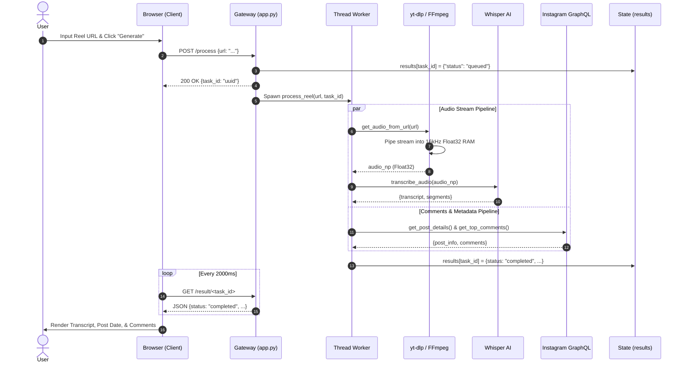
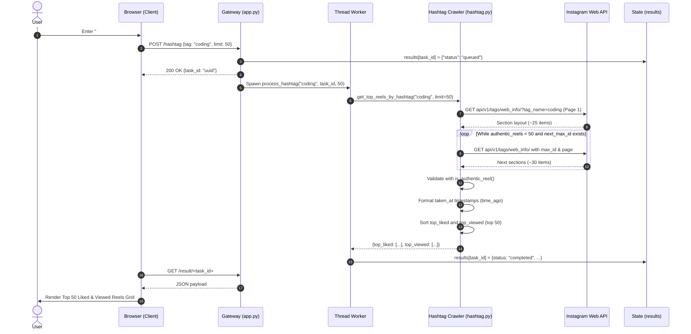

# ReelScribe v2 — Next-Gen Interactive System Architecture & Operational Blueprint

This document provides the complete, authoritative architectural specification for **ReelScribe v2**, detailing its high-concurrency asynchronous pipeline, in-memory audio streaming, Whisper AI speech-to-text integration, Instagram GraphQL scraping, viral hashtag discovery, and multi-format document delivery.

---

## 🏛️ High-Level System Architecture Mesh (v2)

```mermaid
flowchart TD
    subgraph Stage1["STAGE 01 — CLIENT INTERACTION LAYER"]
        UI["Dual-Mode Reactive Web Application (templates/index.html & static/main.js)"]
        Poll["Client State & Async Polling Controller (2s Heartbeat)"]
        Exporter["Multi-Format Document Exporter (.txt, .srt, .pdf)"]
    end

    subgraph Stage2["STAGE 02 — GATEWAY & ORCHESTRATION"]
        Router["API Gateway & Request Normalizer (Flask 3.0 /process, /hashtag)"]
        Queue["Async Thread Dispatcher & State Repository (UUIDv4 Tasks)"]
        Store[("Global In-Memory State Store (results[task_id])")]
    end

    subgraph Stage3["STAGE 03 — PIPELINES & AI SUBSYSTEMS"]
        AudioPipe["In-Memory Audio Pipe: yt-dlp Stream + imageio-ffmpeg Subprocess"]
        WhisperAI["Whisper AI Engine: Singleton Daemon + FP16 CUDA / CPU Fallback"]
        IGScraper["Instagram GraphQL Scraper: Instaloader Session + Query Hash 97b41c..."]
        HashtagEngine["Hashtag Discovery: next_max_id Cursor Pagination + is_authentic_reel Validator"]
    end

    %% Client Interactions
    UI -->|POST /process {url}| Router
    UI -->|POST /hashtag {tag, limit}| Router
    UI -->|GET /download/<id>/<fmt>| Exporter

    %% Gateway Routing
    Router -->|Initialize UUIDv4 Task| Store
    Router -->|Dispatch Worker Thread| Queue
    Queue -->|Worker 1: Stream Audio| AudioPipe
    Queue -->|Worker 1: Scrape Comments| IGScraper
    Queue -->|Worker 2: Explore Hashtag| HashtagEngine

    %% Pipeline Execution
    AudioPipe -->|16kHz Float32 PCM RAM Buffer| WhisperAI
    WhisperAI -->|Transcription & Timestamps| Store
    IGScraper -->|Post Info & Comments JSON| Store
    HashtagEngine -->|Top Liked & Viewed 50 Reels| Store

    %% State Polling & Delivery
    Store -.->|HTTP GET /result/<id> 2000ms| Poll
    Poll -->|State Update & Final Payload| UI
    Exporter -->|Stream io.BytesIO Document| UI
```

---

## 🔍 Detailed Subsystem Breakdown

### 1. Stage 01: Client Presentation & Async Polling
- **Source Files:** [`templates/index.html`](file:///c:/Users/Admin/Desktop/New%20folder/templates/index.html), [`static/main.js`](file:///c:/Users/Admin/Desktop/New%20folder/static/main.js), [`static/style.css`](file:///c:/Users/Admin/Desktop/New%20folder/static/style.css)
- **Key Responsibilities:**
  - **Dual-Mode UI:** Seamless switching between **Reel Transcriber** and **Hashtag Explorer** with zero framework overhead (pure Vanilla JS and CSS glassmorphism).
  - **Universal Referrer Shield:** `<meta name="referrer" content="no-referrer">` prevents Meta/Instagram CDN servers from dropping thumbnail or video requests with `403 Forbidden` errors.
  - **Non-Blocking Polling Heartbeat:** Periodically queries `/result/<task_id>` every 2,000ms, displaying live server progress messages (`"Fetching audio stream..."`, `"Transcribing on GPU..."`, `"Traversing section cursors..."`).
  - **Sanitization & Linkification:** Sanitizes all comment inputs to prevent XSS attacks while converting URLs inside comment bodies into clickable external hyperlinks.
  - **Metric Badging:** Formats high engagement counts into human-readable shorthand (`15.1K`, `1.2M`) and timestamps into relative badges (`🕒 2d ago`, `📅 Sep 16, 2026`).

---

### 2. Stage 02: Gateway, Thread Dispatcher & State Store
- **Source Files:** [`app.py`](file:///c:/Users/Admin/Desktop/New%20folder/app.py)
- **Key Responsibilities:**
  - **API Gateway:** Routes `GET /`, `POST /process`, `POST /hashtag`, `GET /result/<task_id>`, `GET /download/<task_id>/<format>`, `GET /architecture`, and `GET /architecture-v2`.
  - **Sub-15ms Latency:** Validates input parameters, generates a unique UUIDv4 task ID, registers the state, spawns a background `threading.Thread`, and returns immediately with `200 OK`.
  - **Thread-Safe In-Memory Store:** Maps task tokens to execution states (`queued`, `processing`, `completed`, `error`), isolating tasks and avoiding database or file-locking contention.
  - **Zero-Disk In-Memory Exporter:** Streams `.txt`, `.srt`, and `.pdf` files dynamically from `io.BytesIO` memory buffers.

---

### 3. Stage 03: Audio Extraction & Whisper AI Speech-to-Text
- **Source Files:** [`utils/downloader.py`](file:///c:/Users/Admin/Desktop/New%20folder/utils/downloader.py), [`utils/transcriber.py`](file:///c:/Users/Admin/Desktop/New%20folder/utils/transcriber.py)
- **Key Responsibilities:**
  - **Direct Stream URL Extraction:** Uses `yt-dlp` with authenticated session credentials to resolve media stream URLs without downloading MP4 video files to disk.
  - **In-Memory Pipe Processing:** Pipes stream data through `imageio-ffmpeg` via standard output (`stdout=subprocess.PIPE`), converting it directly into 16,000Hz mono s16le raw PCM in memory.
  - **Tensor Normalization:** Converts raw bytes into a Float32 numpy array normalized to `[-1.0, 1.0]` for Whisper neural inference.
  - **Singleton Preloader Daemon:** Preloads the Whisper `base` model in a background daemon thread at server boot, preventing runtime cold starts.
  - **Hardware Auto-Negotiation:** Detects NVIDIA CUDA tensor cores for FP16 inference, automatically falling back to multi-core CPU Float32 execution if unavailable.
  - **SubRip Cue Generator:** Converts timestamp offsets into standard SubRip format (`00:01:23,456 --> 00:01:27,890`).

---

### 4. Stage 04: Instagram GraphQL Scraper & Post Metadata
- **Source Files:** [`utils/comments.py`](file:///c:/Users/Admin/Desktop/New%20folder/utils/comments.py)
- **Key Responsibilities:**
  - **Session Hot-Reloading:** Reloads `.env` session cookies (`IG_SESSIONID`) dynamically on each request without requiring application restarts.
  - **Post Metadata Resolver:** Extracts creator handle, like counts, comment counts, and creation timestamp (`post.date_utc`), converting it to formatted UTC and relative time.
  - **Dual-Path Comment Scraper:**
    1. Fast inspection of embedded post edge metadata (`edge_media_to_parent_comment`).
    2. Deep pagination using Instagram Web GraphQL query hash `97b41c52301f77ce508f55e66d17620e`.
  - **Link Extraction:** Regex detects external links inside comment text and tallies link counts for user inspection.

---

### 5. Stage 05: Viral Hashtag Discovery & Cursor Pagination
- **Source Files:** [`utils/hashtag.py`](file:///c:/Users/Admin/Desktop/New%20folder/utils/hashtag.py)
- **Key Responsibilities:**
  - **Tag Normalizer:** Automatically strips URLs (e.g. `https://www.instagram.com/explore/tags/coding/`), `#` prefixes, and whitespace.
  - **Strict Video Validator (`is_authentic_reel`):** Excludes static photos (`media_type == 1`) and photo carousels (`media_type == 8`), ensuring only vertical video clips with valid `video_versions` are retained.
  - **Multi-Page Cursor Pagination:** Loops through `api/v1/tags/web_info/` using `next_max_id` and `next_page` across multiple layout sections (`one_by_two_left`, `clips`, `fill`) until 50+ validated reels are collected.
  - **Engagement Ranker:** Sorts results into two distinct sets:
    - **Top Liked Reels:** Highest like count descending.
    - **Top Viewed Reels:** Highest view/play count descending.
  - **Timestamp Resolution:** Computes post timestamp (`taken_at`), formatting it into both UTC dates and relative time badges (`"2d ago"`).

---

## ⚡ Operational Sequence Diagrams

### 1. Reel Transcription & Comment Flow


### 2. Hashtag Discovery & Pagination Flow


---

## 🛡️ Resilience, Security & Defensive Architecture

| Feature | Mechanism | Operational Benefit |
| :--- | :--- | :--- |
| **Referrer Stripping** | `<meta name="referrer" content="no-referrer">` | Permanently prevents Meta CDN `403 Forbidden` hotlink rejection for direct video and image streams. |
| **Session Hot-Reloading** | `os.environ` inspection in `get_instaloader_instance()` | Updates session cookies without server restarts if cookies are refreshed in `.env`. |
| **Zero Disk I/O Pipe** | `subprocess.Popen([imageio_ffmpeg, ...], stdout=PIPE)` | Eliminates file creation, temporary file locks, and disk wear by piping audio directly into RAM. |
| **Strict Reel Filter** | `is_authentic_reel()` media inspection | Eliminates non-video static photos and carousels, ensuring 100% video reel reliability. |
| **Unicode Clean Exporter** | `.encode('latin-1', 'replace')` in FPDF | Protects PDF generator from crashing on emojis or unencodable Unicode glyphs. |
| **Thread Containment** | Independent worker try/except wrappers | Ensures a failure in comment scraping does not cancel or corrupt audio transcription delivery. |

---

## 📂 Project Architecture Map

```
c:\Users\Admin\Desktop\New folder\
├── app.py                      # Flask API gateway, async thread dispatcher & exporters
├── architecture/               # Architecture Visualizer v1 (Original)
│   ├── index.html              # Interactive canvas & substructure drawer
│   ├── style.css               # Ambient glassmorphism styling
│   ├── flow.js                 # Dynamic SVG flow lines & simulation
│   └── ARCHITECTURE.md         # Architecture v1 documentation
├── architecture_v2/            # Architecture Visualizer v2 (Next-Gen Cyber)
│   ├── index.html              # Cyberpunk HUD dashboard & live telemetry
│   ├── style.css               # Neon glows, laser cables & particle keyframes
│   ├── flow.js                 # 7-node substructure registry & laser engine
│   └── ARCHITECTURE.md         # This authoritative technical specification
├── templates/
│   └── index.html              # Dual-mode web UI (Reels & Hashtags)
├── static/
│   ├── main.js                 # Client controller, state polling & DOM rendering
│   └── style.css               # Glassmorphic UI stylesheet
├── utils/
│   ├── downloader.py           # yt-dlp & FFmpeg in-memory audio extraction
│   ├── transcriber.py          # OpenAI Whisper singleton AI speech-to-text
│   ├── comments.py             # Instagram GraphQL & post metadata scraper
│   └── hashtag.py              # Multi-page cursor hashtag reel discovery
└── requirements.txt            # System dependencies
```
